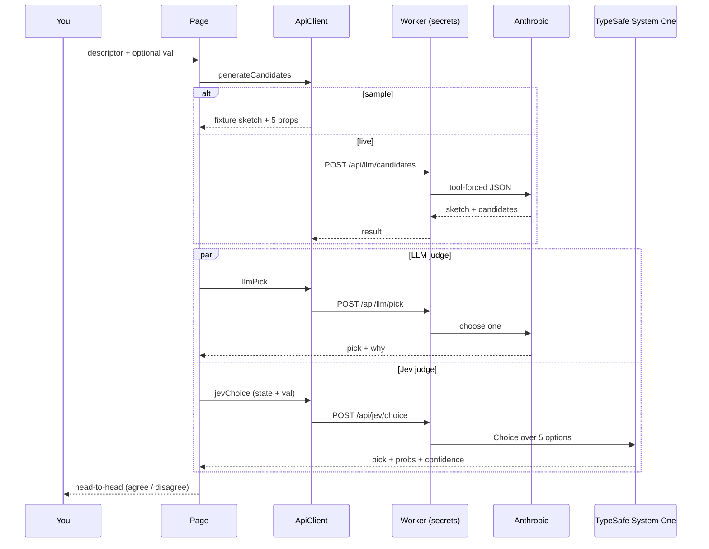

# naming-things

Describe something in prose. Get **five** names for one class property. Watch **LLM vs Jev** pick head-to-head.

```text
descriptor ──► five candidates + tiny interface sketch
                 │
                 ├── LLM pick  (one name + one-line why)
                 └── Jev Choice (probs + confidence)
                        ▲
                   optional val (style weights)
```

Sample mode needs **no keys**. Live mode goes through a Cloudflare Worker that holds secrets.

- Live Worker: `https://naming-things.who-cf.workers.dev`
- Live demo: `https://who.github.io/naming-things/`

Pinned models: `claude-haiku-4-5-20251001` · `jev-1.13.0`

---

## Quick start

```bash
npm install
npm run dev
```

Open [http://localhost:5173/naming-things/](http://localhost:5173/naming-things/) — the `/naming-things/` base path matches GitHub Pages.

```bash
npm run build      # → dist/
npm run preview
npm run typecheck
npm test           # app + Worker suites
```

---

## How one run works



```text
Run
  parse descriptor
  generateCandidates   # sketch + exactly 5 {name, typeHint, why}
  Promise.allSettled
    llmPick
    jevChoice          # buildJevState(descriptor, code, candidates, val?)
  render cards + badges
Re-ask Jev
  reuse candidates on screen
  jevChoice only       # val change can move the pick
```

---

## Layout

```text
naming-things/
├── src/
│   ├── core/          # pipeline, parser, types — no DOM, no network
│   ├── api/           # ApiClient: sample | remote (Worker) | byo
│   ├── ui/            # cards, banner, val controls, state JSON
│   └── fixtures/      # canned head-to-head for zero-key demos
├── worker/            # Cloudflare Worker — only place secrets live
│   ├── src/           # cors, llm, jev, ratelimit, router
│   └── wrangler.toml
└── .github/workflows/pages.yml
```

```text
<Page> (src/main.ts)
  descriptor + Randomize + valControls
  Run / Re-ask Jev
  property cards (5)
  LLM badge  vs  Jev badge
  State sent to Jev (JSON)
```

---

## Modes

```text
resolveMode()
  if localStorage naming-things:keys has both keys → byo
  else if VITE_API_BASE set at build               → remote (Worker)
  else                                              → sample
```

| Mode | Keys | Where calls go |
|------|------|----------------|
| sample | none | fixtures |
| remote | Worker secrets | `VITE_API_BASE` → Worker |
| byo | both keys in `localStorage` | browser → Anthropic + TypeSafe |

**Public demo = remote only.** Never paste keys into the hosted page.

Worker secrets (already used for the live stub):

```bash
cd worker
npx wrangler secret put ANTHROPIC_API_KEY
npx wrangler secret put TYPESAFE_API_KEY
```

Health check (no quota cost):

```bash
curl https://naming-things.who-cf.workers.dev/api/health
# {"ok":true,"hasTypeSafe":true,"hasAnthropic":true,...}
```

---

## `val` — style import

`val` rides in Jev **state** as context, not a hard gate in app code.

```text
StyleVal
  naming:   camelCase | snake_case | PascalCase
  prefer:   id-like | domain-nouns | booleans-as-isX   (any subset)
  weights:  shortNames | explicitUnits | nullable       (0..1)
```

```diff
 buildJevState(...)
   descriptor
   code
   candidates
+  val          # from the style controls / localStorage
```

Push `explicitUnits` up, hit **Re-ask Jev**, watch `weight` lose to `weightGrams` on the sample run.

---

## Deploy

### Pages (static app)

```text
push main
  → Actions: npm ci && npm run build
  → upload dist/
  → https://who.github.io/naming-things/
```

A fork enables its own copy under repo **Settings → Pages → Source → GitHub Actions**.

Optional build env (URL only — never a key):

```text
VITE_API_BASE=https://naming-things.who-cf.workers.dev
```

### Worker

```bash
cd worker
npm install
npx wrangler kv namespace create RATE_LIMIT   # paste id into wrangler.toml
# ALLOWED_ORIGINS already includes who.github.io + localhost:5173
npm run deploy
```

Routes: `POST /api/llm/candidates` · `POST /api/llm/pick` · `POST /api/jev/choice` · `GET /api/health`

Caps (wrangler vars): `IP_DAILY_LIMIT=20` · `GLOBAL_DAILY_LIMIT=300`

---

## Rules this repo does not bend

1. **No secrets in `import.meta.env`** — Vite would bake them into `dist/`.
2. **No committed `.env`.**
3. **No keys in the Pages bundle** — Worker (or local BYO) only.
4. **Jev = Choice only** here — Noul has no confidence; the demo needs probs.

---

## Limitations

One property per run. Sample vs live can disagree with each other and with you — that disagreement is the point. Rate-limit / provider failures latch the run to sample and name the reason in the banner.
