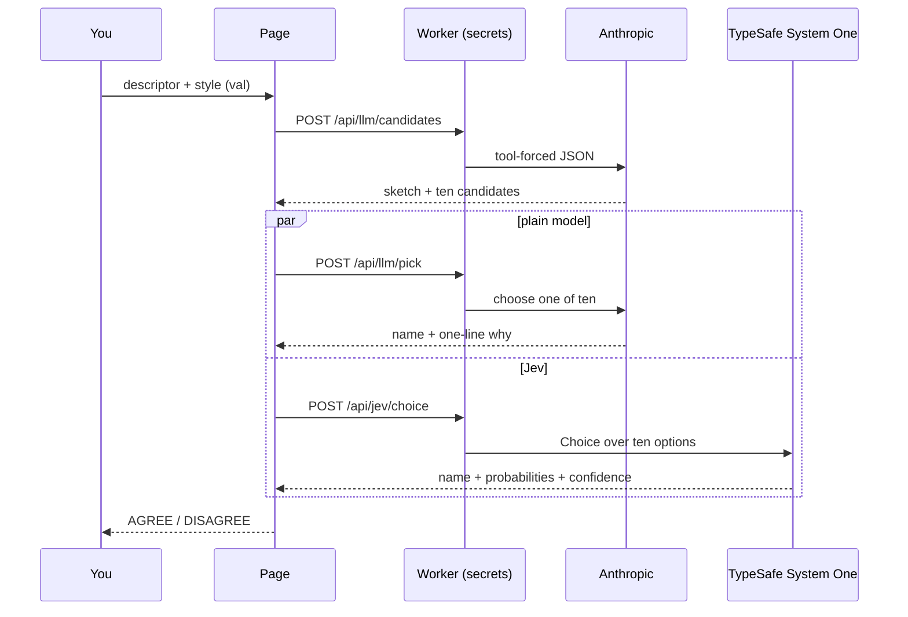

# naming-things

Describe one property in prose. Get **ten** candidate names. Watch a plain LLM and **Jev Choice** each pick one, and see whether they agree.

**Next action:** open the demo, press **Randomize**, press **Run**.

- Demo (Pages): <https://who.github.io/naming-things/>
- API (Worker): <https://naming-things.who-cf.workers.dev>
- Pinned judges: `claude-haiku-4-5-20251001` · `jev-1.13.0`

Every run is a live run. The hosted page calls a Cloudflare Worker that holds the
secrets; a local page can spend your own keys instead. Nothing is filled in from a
fixture behind either one — a call that will not answer says so on the page.

---

## Try it in the browser (~1 min)

1. Open <https://who.github.io/naming-things/>.
2. **Randomize** — the Worker writes a fresh brief into the box. ~3 s
3. **Run** — ten cards, then each judge's badge, each with the wait it cost. ~5 s
4. Push **explicitUnits** up under **Advanced options** (open by default) and press **Re-ask Jev**. ~3 s

**What to watch for:** the orange card (plain model) and the blue card (Jev) are
often not the same card, and step 4 can move the blue one without touching the ten
names. That disagreement is the whole demo.

## Run it locally (~2 min)

```bash
npm install     # ~1 min
npm run dev     # ~5 s
```

Open <http://localhost:5173/naming-things/> — the `/naming-things/` base path matches
GitHub Pages.

A dev page with no API and no stored keys is **unconfigured**: it says so, and the
buttons stay down. Point it at the deployed Worker (a URL, never a key):

```bash
echo 'VITE_API_BASE=https://naming-things.who-cf.workers.dev' > .env.local
```

Everything else:

```bash
npm run build      # → dist/
npm run preview
npm run typecheck
npm test           # app + Worker suites
```

---

## How one run works



```text
Run  (src/main.ts → runPipeline)
  generateCandidates      sketch + exactly 10 {name, typeHint, why}
  both clocks start
  Promise.allSettled
    llmPick               → orange badge + orange card
    jevChoice             → blue badge + blue card   (buildJevState carries val)
  verdict banner
Re-ask Jev
  same ten names on screen
  jevChoice only          a style change can move the blue pick alone
```

Each judge's badge counts up while it waits and keeps its own duration once its
answer lands — including when it fails, because a nine-second failure cost nine
seconds.

## What is on the page

```text
masthead   tagline + legend (orange = plain LLM, blue = Jev)
controls   descriptor box · Randomize · Run · Re-ask Jev
           Advanced options (open): naming · prefer · weights
           State sent to Jev  → modal with the exact payload
cards      ten property cards, the two picks highlighted
verdict    LLM badge   vs   Jev badge     AGREE / DISAGREE
```

---

## Modes

```text
resolveMode()
  localStorage "naming-things:keys" holds both keys → byo
  else VITE_API_BASE set at build                   → live
  else                                              → unconfigured
```

| Mode | Keys live | Calls go |
|------|-----------|----------|
| live | Worker secrets | browser → Worker → providers |
| byo | both keys in `localStorage`, put there by hand | browser → Anthropic + TypeSafe |
| unconfigured | nowhere | nowhere — the page says so, buttons stay down |

**The public demo is live mode only.** Never paste a key into the hosted page.

## `val` — style import

`val` rides inside the Jev **state** as context, not as a gate in app code.

```text
StyleVal
  naming:   camelCase | snake_case | PascalCase
  prefer:   id-like | domain-nouns | booleans-as-isX   (any subset)
  weights:  shortNames | explicitUnits | nullable      (0..1)
```

```diff
 buildJevState(...)
   descriptor
   code
   candidates
+  val          # from the style controls, saved in localStorage
```

Press **State sent to Jev** to read the payload before you send it.

---

## Deploy

### 1. Pages — the static app (~2 min, mostly CI)

```text
push main
  → .github/workflows/pages.yml: npm ci && npm run build
  → VITE_API_BASE baked in as a URL
  → upload dist/ → https://who.github.io/naming-things/
```

A fork turns on its own copy under **Settings → Pages → Source → GitHub Actions**.

### 2. Worker — the only place secrets live (~1 min)

```bash
cd worker
npm install
npx wrangler kv namespace create RATE_LIMIT   # first time only; paste the id into wrangler.toml
npx wrangler secret put ANTHROPIC_API_KEY
npx wrangler secret put TYPESAFE_API_KEY
npm run deploy
```

Routes: `POST /api/llm/candidates` · `POST /api/llm/pick` · `POST /api/llm/descriptor` ·
`POST /api/jev/choice` · `GET /api/health`

Health check (free, no quota):

```bash
curl https://naming-things.who-cf.workers.dev/api/health
# {"status":"ok"}
```

`wrangler.toml` vars: `ALLOWED_ORIGINS` (the origins allowed to spend this Worker's
budget — `https://who.github.io` and `http://localhost:5173`, never a wildcard),
`IP_DAILY_LIMIT = 5000`, `GLOBAL_DAILY_LIMIT = 100000`. Quota is counted before the
body is read, so a malformed-body loop cannot dodge it.

> The deployed Worker can lag `main`. When the two disagree, `main` is the source of
> truth and the redeploy is tracked as its own issue.

---

## Layout

```text
naming-things/
├── src/
│   ├── core/     pipeline, parser, descriptors, types — no DOM, no network
│   ├── api/      ApiClient: mode.ts picks remote | byo | none
│   └── ui/       cards, badges, pick timers, val controls, state modal
├── worker/       Cloudflare Worker — only place secrets live
│   ├── src/      index (router), llm, jev, cors, ratelimit
│   └── wrangler.toml
├── test/         app suites        worker/test/ Worker suites
└── .github/workflows/pages.yml
```

## Rules this repo does not bend

1. **No secrets in `import.meta.env`** — Vite bakes those into `dist/`.
2. **No committed `.env`.**
3. **No keys in the Pages bundle** — Worker, or local BYO, only.
4. **Jev = Choice only** here — the demo needs probabilities and confidence.
5. **No stand-in answers** — a failed call is reported, never papered over.

## Limits

One property per run. Both judges can disagree with each other and with you. A
rate-limited or failing provider ends the run and says which of those it was: spent
quota, unconfigured service, busy upstream, provider error, or a connection that
never reached anything.
